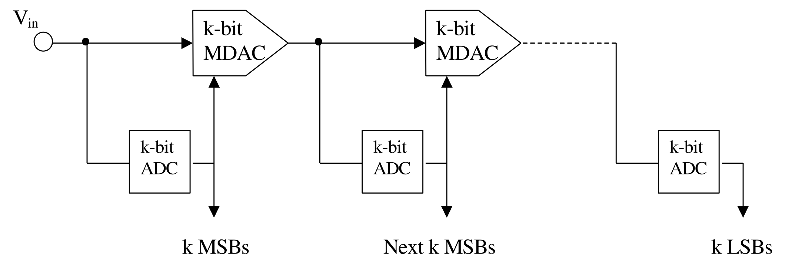
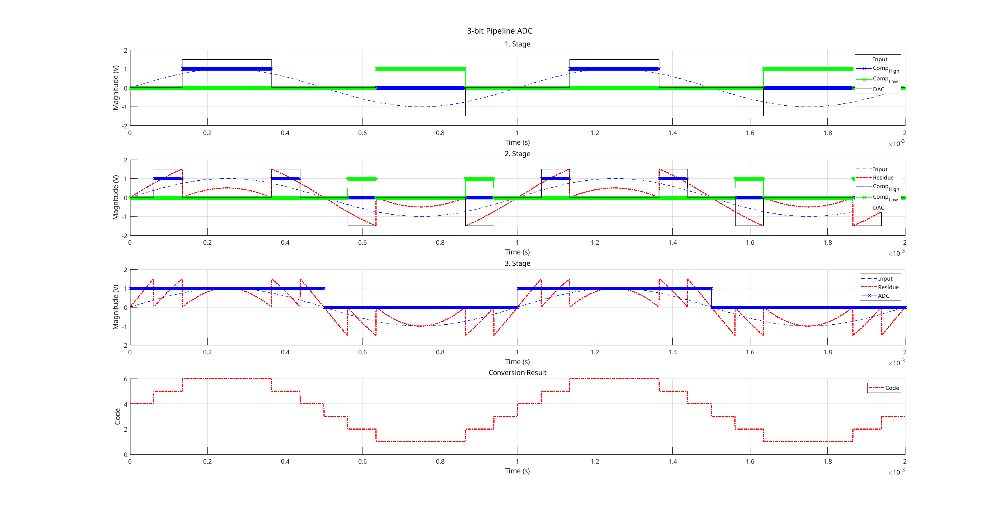
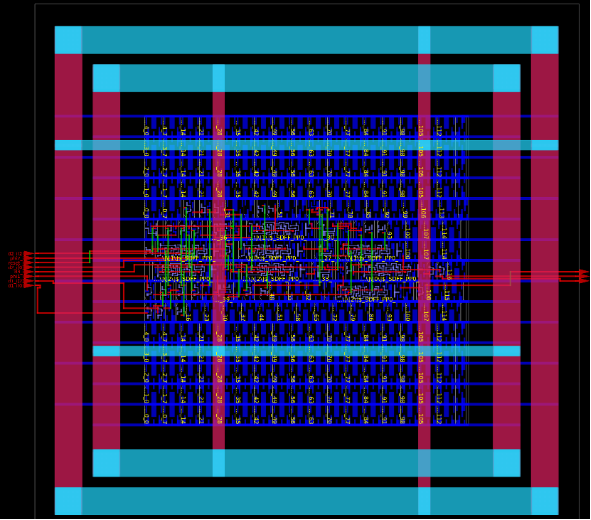
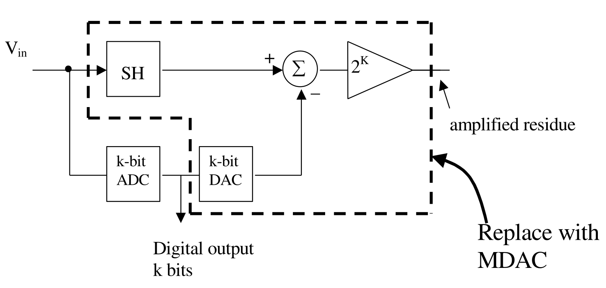
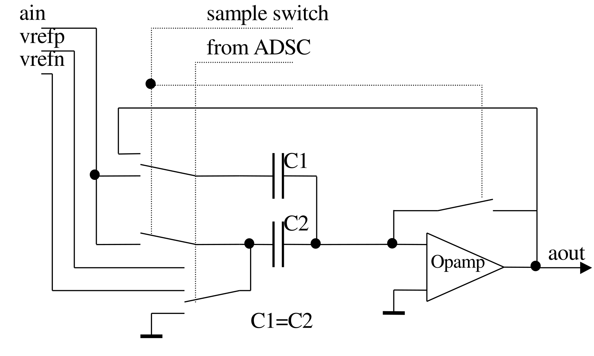
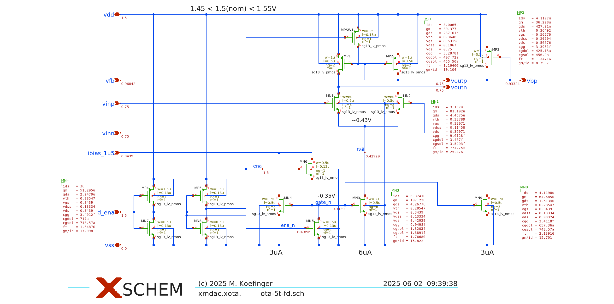

# Overview
- Introduction
- Specifications
- Principle of Operation
- System-Level Simulation
- Digital Core
- ADC Macro Model
- MDAC Design
- Circuit-Level Simulation	
	
# Introduction
- Tools
	- IIC\_OSIC\_TOOLS Docker container
	- IHP SG13G2 open-source PDK
	- Xschem/ngspice/verilator (analog/mixed-signal simulation)
	- Modelsim (digital simulation)
- Objective
	- Design and simulate a 3-bit pipeline ADC w/ \qty{1.5}{\bit} architecture
	- Mixed-signal/level simulation w/ Xschem/ngspice/verilator
	- Digital core using RTL and gate-level simulation
	- Design CMOS OTA
	- ADC: macro models
	- Switches: ideal
	
# Specifications
- $n = \qty{3}{\bit}$
- $n_{1,2} = \qty{1.5}{\bit}$
- $n_{3} = \qty{1}{\bit}$
- $f_\mathrm{s} = \qty{2}{\mega\hertz}$
- $V_\mathrm{DD} = \qty{1.5}{\volt}$
- $V_\mathrm{ref} = V_\mathrm{DD}$

# Principle of Operation

```{=latex}
\begin{center}
```
{width=100%}
```{=latex}
\end{center}
```

# System-Level Simulation
```{=latex}
\begin{center}
```
{width=100%}
```{=latex}
\end{center}
```

# System-Level Simulation cont' 
```{=latex}
\begin{center}
```
{width=72%}
```{=latex}
\end{center}
```

# 3-bit Implementation w/ 1.5-bit Architecture
```{=latex}
\begin{center}
```
{width=100%}
```{=latex}
\end{center}
```

# Digital Core
- Add ADC outputs from each stage
- RTL simulation using Modelsim and Xschem
- Digital models generated from Ngspice circuits
- HDL (Verilog) used for digital model implementation
- Verilator creates a .so (shared object) file (referenced by Xschem symbol)
```{=latex}
\begin{center}
```
{width=50%}
```{=latex}
\end{center}
```

# Digital Core cont'
- Modelsim simulation
```{=latex}
\begin{center}
```
{width=100%}
```{=latex}
\end{center}
```

# Digital Core cont'
- Synthesis using Yosys (generating a xspice-file) 
- Target size 100 x 100 µm

```{=latex}
\begin{center}
```
{width=30%}
```{=latex}
\end{center}
```


# Tri-Level ADC Macro Model
- Ideal comparator implemented using ADC bridges
- Data is latched during vclk and synchronized on the rising edge of vclk_reg
- Use DAC bridges to convert analog signals to digital format

```{=latex}
\begin{center}
```
{width=50%}
```{=latex}
\end{center}
```

# MDAC Design
- Sample/Track and hold, k-bit DAC, subtract and amplify

```{=latex}
\begin{center}
```
{width=60%}
```{=latex}
\end{center}
```

# MDAC Design cont'
- $V_\mathrm{out}[n+1] = -2 V_\mathrm{in}[n] - V_\mathrm{ref}[n+1]$
```{=latex}
\begin{center}
```
{width=50%}
```{=latex}
\end{center}
```

# MDAC Design cont'
- Fully-differential: invert input to get desired operation
```{=latex}
\begin{center}
```
{width=70%}
```{=latex}
\end{center}
```

# MDAC Design cont'
- $V_\mathrm{o}(t) = -V_\mathrm{step}\frac{1}{\beta}\frac{L_0}{1+L_0}(1-e^{-t/\tau_\mathrm{o}})\quad\rightarrow\quad \epsilon_\mathrm{d} = e^{-t/\tau_\mathrm{o}}$
- $\tau_\mathrm{o} \approx \omega_\mathrm{ug}$
- Settling accuracy: $\epsilon_\mathrm{d,target} = 1/2^{n-n_1} = 2^{-2} = 0.25$
- $T_\mathrm{settle} = 1/f_\mathrm{s}/2$
- $N_\mathrm{settling} = \frac{T_\mathrm{settle}}{\tau_\mathrm{o}} = -\ln(\epsilon_\mathrm{d,target}) = \num{1.4}\quad\rightarrow\quad 2$
- $C_1 = C_2 = \qty{100}{\femto\farad}$ (sufficient in terms of kT/C noise for 3-bit)
- DC gain from static error
- Slew-rate: $\mathrm{SR} = V_\mathrm{o,step}/T_\mathrm{settle} = I_\mathrm{d}/C_\mathrm{load}$
- $\rightarrow\quad$ use gm/Id design script for OTA design

# MDAC Design cont'
- Keep it simple: basic 5T OTA w/ SC-CMFB (account for additional loading)
```{=latex}
\begin{center}
\small
```
{width=65%}
```{=latex}
\end{center}
\normalsize
```

# Circuit Level Simulation 
```{=latex}
\begin{center}
\small
```
{width=90%}
```{=latex}
\end{center}
\normalsize
```

# Circuit Level Simulation 
```{=latex}
\begin{center}
\small
```
{width=90%}
```{=latex}
\end{center}
\normalsize
```

# Summary and Known Issues
- Gain error
- ADC macro only handles $f_\mathrm{sig} < f_\mathrm{s}/10$
- Redesign OTA for more gain (different architecture e.g. two-stage, folded-cascode)
- INL, DNL calculation is missing

